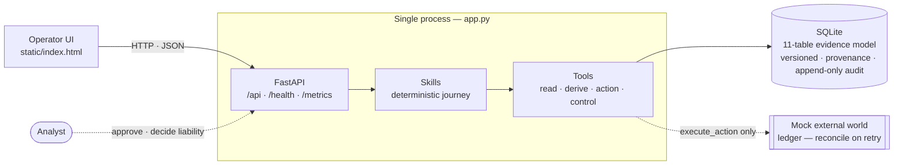

# Card Dispute Evidence Agent

[](https://github.com/Bratz/card-dispute-agent/actions/workflows/ci.yml)

An evidence-reconciliation case manager for card payment disputes. It reconstructs
the disputed event from scattered evidence, keeps every version, holds competing
positions open, recommends the next permitted step — and leaves the liability
decision to a person.

Built for the **Card Dispute Evidence Reconstruction & Resolution** challenge.

---

## The problem

A card dispute pulls in conflicting accounts — the cardholder, the merchant, and
the systems of record — and the important facts often arrive **late, after the
case has already moved on**. A good solution has to:

- assemble evidence that arrives asynchronously, is corrected, or conflicts;
- reconstruct a trustworthy event and make gaps and contradictions explicit;
- recommend the next useful evidence or permitted action;
- never lose earlier evidence, and keep a complete audit trail;
- keep the **final liability decision human-owned**.

The hardest moment is the finale test: **a merchant supplies material evidence
late that contradicts the cardholder.** The system must take it in, re-assess the
dependent conclusions, and make the change visible.

## What this does

- **Runs the journey in code** — a real case is opened, evidence assembled, the
  event reconstructed, positions compared, gaps found, and the next action
  proposed — all from the database, not a script.
- **Versioned evidence** — corrections and rebuilds are new versions; nothing is
  overwritten. Timeline `v1 → v2`, previous kept.
- **Competing positions** — both interpretations stay on file with the evidence
  for and against each; no single opaque score.
- **Exceptions** — missing, stale, duplicate and contradictory evidence are
  surfaced explicitly.
- **Recommended action, behind an approval gate** — nothing leaves the bank
  without a human sign-off.
- **Safe actions** — every external action is **idempotent** (runs once) and
  **recovers from partial failure**: on a timeout it reconciles against the
  external record before retrying, and compensates on hard failure.
- **Human-owned liability** — no rule or model sets the outcome; only the
  analyst's decision path writes it.
- **Card data redacted at intake** — a card number is stored as a token + last
  four; CVV/PIN are dropped.
- **Observable & auditable** — `/health`, `/metrics`, structured logs, and an
  append-only audit trail.

## Quick start

```bash
pip install -r requirements.txt
python app.py
```

Open **http://127.0.0.1:8137** (set `PORT=9000` to change it).

In the UI: open **DSP-100205**, then

1. click **“Merchant evidence arrives (late)”** and watch the case reassess;
2. on the recommended action, **Approve**, set the Execute dropdown to
   **timeout**, hit **Execute**, then **Retry** — it reconciles with no second
   effect; try **fail** to see compensation;
3. record a **liability decision** to close the case. **Reset demo** restarts it.

Run the checks:

```bash
python smoke.py
```

## Architecture

Three layers, and one process serves the API and the UI.



Only `execute_action` reaches the external world; every external effect is
idempotent and approval-gated, and the analyst owns the liability decision.

- **State store** — 11 tables: a versioned, provenance-tagged evidence model with
  an append-only audit and idempotency keys. See `docs/DESIGN.md` for the full
  model, tools and skills.
- **Tools** — 20 functions over the schema (read / derive / action / control).
  Only one, `execute_action`, touches the (mock) external world.
- **Skills** — nine deterministic procedures that run the journey. The reasoning
  is rule-based so the demo is robust and offline; an optional LLM narrative can
  be enabled with `CARD_DISPUTE_LLM=1`.

## Data & security

- **Synthetic data only.** No real cardholder or transaction data is used or
  required.
- Card numbers are **redacted on intake** (token + last four; CVV/PIN dropped),
  so nothing that could rebuild a card is stored.

## What is not built yet

Deliberately out of scope for this slice: direct card-network integration
(VROL / Mastercom), the regulatory clocks (provisional credit, response windows),
and production scale. Mock interfaces stand in for external systems.

## Project layout

```
schema.sql          SQLite domain model (11 tables)
service.py          tools + deterministic skills + seed + mock external world
app.py              FastAPI: endpoints + serves the UI
static/index.html   the operator UI
smoke.py            one assert-based end-to-end check
docs/DESIGN.md      the full domain model, tools and skills
```

## Licence

MIT — see [LICENSE](LICENSE).
