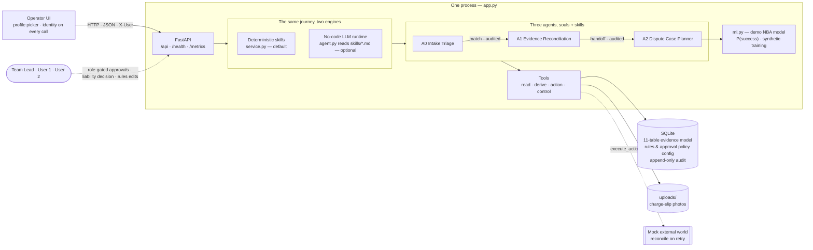

# Card Dispute Evidence Agent

[](https://github.com/Bratz/card-dispute-agent/actions/workflows/ci.yml)

An evidence-reconciliation case manager for card payment disputes. It reconstructs
the disputed event from scattered evidence, keeps every version, holds competing
positions open, recommends the next permitted step — and leaves the liability
decision to a person.

Built for the **Card Dispute Evidence Reconstruction & Resolution** challenge.

**Full feature list, mapped to the challenge's capability expectations — with
deep-dives on the dynamic next-best-action selection and partial-failure
recovery: [FEATURES.md](FEATURES.md). Timed demo script: [DEMO.md](DEMO.md).**

---

## The problem

A card dispute pulls in conflicting accounts — the cardholder, the merchant, and
the systems of record — and the important facts often arrive **late, after the
case has already moved on**. A good solution has to:

- assemble evidence that arrives asynchronously, is corrected, or conflicts;
- reconstruct a trustworthy event and make gaps and contradictions explicit;
- recommend the next useful evidence or permitted action;
- never lose earlier evidence, and keep a complete audit trail;
- keep the **final liability decision human-owned**.

The hardest moment is the finale test: **a merchant supplies material evidence
late that contradicts the cardholder.** The system must take it in, re-assess the
dependent conclusions, and make the change visible.

## What this does

- **Runs the journey in code** — a real case is opened, evidence assembled, the
  event reconstructed, positions compared, gaps found, and the next action
  proposed — all from the database, not a script.
- **Versioned evidence** — corrections and rebuilds are new versions; nothing is
  overwritten. Timeline `v1 → v2`, previous kept.
- **Competing positions** — both interpretations stay on file with the evidence
  for and against each; no single opaque score.
- **Exceptions** — missing, stale, duplicate and contradictory evidence are
  surfaced explicitly.
- **Recommended action, behind an approval gate** — nothing leaves the bank
  without a human sign-off.
- **Safe actions** — every external action is **idempotent** (runs once) and
  **recovers from partial failure**: on a timeout it reconciles against the
  external record before retrying, and compensates on hard failure.
- **Human-owned liability** — no rule or model sets the outcome; only the
  analyst's decision path writes it.
- **Card data redacted at intake** — a card number is stored as a token + last
  four; CVV/PIN are dropped.
- **Observable & auditable** — `/health`, `/metrics`, structured logs, and an
  append-only audit trail.

## Quick start

```bash
pip install -r requirements.txt
python app.py
```

Open **http://127.0.0.1:8137** (set `PORT=9000` to change it).

In the UI: open **DSP-100205**, then

1. click **“Merchant evidence arrives (late)”** and watch the case reassess;
2. on the recommended action, **Approve**, set the Execute dropdown to
   **timeout**, hit **Execute**, then **Retry** — it reconciles with no second
   effect; try **fail** to see compensation;
3. record a **liability decision** to close the case. **Reset demo** restarts it.

Run the checks:

```bash
python smoke.py
```

## Architecture

Three layers, and one process serves the API and the UI.



The same journey runs on either engine — deterministic skills by default, or the
LLM reading the skill files (edit a `SKILL.md`, behaviour changes, no Python).
Only `execute_action` reaches the external world; every external effect is
idempotent and approval-gated. Money-moving actions need the Team Lead, the
liability decision is always a person's, and the demo ML model only supplies the
success probability inside the auditable score — it never acts.

- **State store** — 11 tables: a versioned, provenance-tagged evidence model with
  an append-only audit and idempotency keys. See `docs/DESIGN.md` for the full
  model, tools and skills.
- **Tools** — 20 functions over the schema (read / derive / action / control).
  Only one, `execute_action`, touches the (mock) external world.
- **Agents** — two agents, each with a fixed *soul* (role, rules, safety limits):
  **A1 Evidence Reconciliation** and **A2 Dispute Case Planner** (`GET /api/agents`).
- **Skills** — nine procedures run the journey (five for A1, four for A2). They are
  **deterministic** by default — predictable, offline and auditable. Set
  `CARD_DISPUTE_LLM=1` for a hybrid mode where the A2 agent, driven by its soul,
  adds a plain-language rationale for the proposed step; it never changes state.

## Users, roles and configurable rules

Three profiles ship with the demo: **Team Lead**, **User 1** and **User 2**
(analysts). Pick one in the top bar; every call carries that identity, and the
server enforces it — an analyst can approve an evidence request, but raising a
chargeback, representment or closing the case needs the Team Lead. Every approval
and the liability decision is recorded with the person's name.

The **Rules** button opens Administration: the reason-code rules (required
evidence, representment window, permitted actions) and the approval policy (who
signs off each action) are stored in the database and edited there — only the
Team Lead can save. No code change is needed to change the operating rules.

## Automatic case assignment — the A0 Intake Triage agent

Evidence can arrive with **no case reference** — a delivery record on a merchant
feed, a message, an authentication event. `POST /api/ingest` hands it to the
**A0 Intake Triage** agent, which redacts it, works out what kind of item it is,
and finds its case by the strongest key: a quoted dispute reference or
transaction id (exact), an order id or tracking number already on one open case
(strong), or a card token plus amount (weak). **It attaches only on exact or
strong matches** and records why. Weak, ambiguous or unmatched items wait in an
**Intake queue** for a person, with A0's best suggestion attached — because
attaching evidence to the wrong case is worse than leaving it unattached. The
finale inject runs through this path: the late delivery record arrives cold and
finds its case by order id.

## Evidence intake — all seven kinds, photos included

The case screen has an **Add evidence** form covering all seven kinds: cardholder
statement, merchant record, transaction record, receipt / charge slip, delivery
record, authentication event, correspondence. A charge slip can be attached as a
**photo** with typed fields; the image is stored with the evidence and shown on
the case. Card numbers in any text are masked on intake. With the LLM enabled,
the vision model also reads the slip and fills in missing fields (typed fields
always win). Each new item re-runs the reconciliation, and A1's handoff to A2 is
written to the audit trail.

Three more things the case handles by itself: a **corrected item** (the same
tracking number with new content) **supersedes** the earlier version — which is
kept, never deleted — and the case reassesses; evidence far **older** than the
newest item on the case is flagged **stale**; and a new dispute can be **raised
from the console** ("Raise dispute"), which starts the journey from step one.

## Next Best Action — scored, with a demo ML model

The next step is chosen by a transparent score:

```
score = P(success) × amount factor × deadline urgency × authority
```

- **Dependencies are a hard filter**, not a score: a representment is excluded —
  and the blocker named in the audit — while required evidence is missing or a
  contradiction is open.
- **P(success) comes from a small logistic-regression model** (`ml.py`, pure
  Python, no extra dependencies) with interaction features, trained at seed time.
  **Honest label: the training data is synthetic**, generated to behave like
  plausible dispute outcomes — the model demonstrates the pipeline
  (features → training → calibrated probability → auditable score), not
  intelligence learned from real cases. In production the same features retrain
  on the bank's real won/lost outcomes, which the audit trail already records.
- **Every proposal records its breakdown** — probability, urgency, authority,
  amount factor, and what was blocked and why — so "why this action" is always
  answerable. The UI shows the estimated chance of success on each proposal.
- Under 48 hours to the representment window with no possible action, the case
  is escalated to a person.

## No-code runtime (optional)

The deterministic engine is the default. There is a second way to run the same
work: an LLM agent, driven by its **soul**, reads the matching skill from
`skills/<name>/SKILL.md` at runtime and calls the tools. **Editing a skill file
changes what the agent does — with no Python change.** That is the no-code runtime.

```bash
pip install anthropic
export ANTHROPIC_API_KEY=...          # your key
export CARD_DISPUTE_LLM=1
python app.py
curl -X POST http://127.0.0.1:8137/api/cases/DSP-100205/run-agent
```

The response returns the updated case plus a transcript of which skills the agent
read and which tools it called. The loop is the standard Anthropic tool-use
pattern (`agent.py`) — written from scratch, no third-party framework. The agent
proposes actions for approval and never executes; card data stays data, not
instructions.

**A0 also runs no-code**: `POST /api/intake/{id}/run-agent` (or the "Run A0"
button on an intake item) triages a cold item with the LLM reading the
`intake-triage` skill. The judgment is the model's; the safety is not — the
`attach_to_case` tool **re-verifies the match server-side** and refuses unless a
certain key really links the item to that case, so even a wrong guess cannot put
evidence on the wrong dispute. Anything refused goes to the human queue.

## Data & security

- **Synthetic data only.** No real cardholder or transaction data is used or
  required.
- Card numbers are **redacted on intake** (token + last four; CVV/PIN dropped),
  so nothing that could rebuild a card is stored.
- Identity in the demo is a **profile switch with server-side role enforcement**
  — a stand-in for real authentication, which is out of scope for a synthetic
  demo. The role checks, approver names and audit trail are real.

## What is not built yet

Deliberately out of scope for this slice: direct card-network integration
(VROL / Mastercom), the regulatory clocks (provisional credit, response windows),
and production scale. Mock interfaces stand in for external systems.

## Project layout

```
schema.sql          SQLite domain model (11 tables)
service.py          tools + deterministic skills + seed + mock external world
app.py              FastAPI: endpoints + serves the UI
static/index.html   the operator UI
smoke.py            one assert-based end-to-end check
docs/DESIGN.md      the full domain model, tools and skills
```

## Licence

MIT — see [LICENSE](LICENSE).
