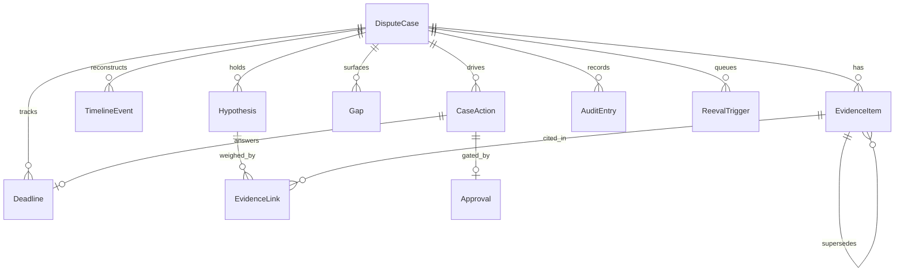

# Card Dispute Evidence — domain model, tools & skills
### Use case A (PS 01). A self-contained build spec.

This is the substrate the two Card Dispute agents sit on. It answers one
question: **what is the smallest durable model, and the smallest set of tools on
top of it, that lets the skills do their job** — reconstruct a disputed card
event, expose gaps and contradictions, hold competing interpretations, and
propose the next permitted action — while never losing earlier evidence and never
letting the AI decide liability.

Order of the document: the **domain model** first (the state), then the **tools**
that read and write it (the safe API on top), then the **skills** that call those
tools (the procedures). Nothing above the model is allowed to touch the outside
world except through the action tools, and those are idempotent and approval-gated.

---

## 1. Design principles (why the model looks like this)

These five come straight from the use case and shape every table below.

1. **Never lose evidence.** Late or corrected evidence *supersedes* a prior
   version; the prior version stays. Everything derived is versioned too.
2. **Separate what kind of thing each statement is.** Every stored assertion
   carries an `assertion_type`: `recorded_fact`, `ai_inference`, `user_input`,
   `automated_action`, or `human_decision`. The AI's guesses never masquerade as
   recorded fact.
3. **Provenance on every item.** Source system, authority tier, who supplied it,
   when it was fetched.
4. **Actions run once.** Any external or irreversible step carries an
   `idempotency_key` and needs an approval before it executes. Re-running returns
   the prior result instead of acting twice.
5. **Material change triggers targeted re-evaluation.** A changed fact does not
   silently leave an old conclusion standing — it raises a `ReevalTrigger` scoped
   to exactly what must be recomputed (the timeline, the hypotheses, or both).

**Where the five assertion types actually live** — partly a tag, partly separate
tables, so the separation is structural, not just a label:

| Assertion type | Stored as |
|---|---|
| recorded_fact | `EvidenceItem` tagged `recorded_fact` |
| ai_inference | `EvidenceItem` / `TimelineEvent` / `Hypothesis` tagged `ai_inference` |
| user_input | `EvidenceItem` tagged `user_input` |
| automated_action | `CaseAction` (its own table) |
| human_decision | `Approval` and `DisputeCase.liability_outcome` |

---

## 2. The domain model (minimum)

### 2.1 Core state

**DisputeCase** — the root. One per dispute.

| Field | Type | Note |
|---|---|---|
| case_id | id (PK) | |
| customer_id, card_id, disputed_txn_id | id | the anchor transaction |
| reason_code | enum | scheme dispute reason; drives required evidence + windows |
| amount, currency | money | |
| stage | enum | raised → gathering → reconstructed → interpreting → awaiting_approval → actioned → resolved / withdrawn |
| status | enum | active / on_hold / closed |
| liability_outcome | enum, **nullable** | **human-owned. No tool may set this.** Null until a person decides. |
| version | int | optimistic lock |
| opened_at, updated_at | ts | |

**EvidenceItem** — every piece of evidence, versioned and provenance-tagged. One
table, typed by `kind`; this is the heart of the model.

| Field | Type | Note |
|---|---|---|
| evidence_id | id (PK) | |
| case_id | fk | |
| kind | enum | customer_statement / merchant_record / transaction_event / receipt / delivery_record / auth_event / correspondence |
| assertion_type | enum | recorded_fact / ai_inference / user_input |
| payload | json | shape depends on `kind` |
| source_system, source_authority, supplied_by | text | provenance |
| effective_at | ts | when the real-world event happened |
| received_at | ts | when we ingested it |
| content_hash | text | for idempotent ingest + duplicate detection |
| confidence | float | for inferences; 1.0 for recorded facts |
| supersedes | fk → EvidenceItem, nullable | the prior version this replaces |
| status | enum | active / superseded / duplicate_of |

> Correction of a fact = a **new** EvidenceItem with `supersedes` pointing at the
> old one; the old row flips to `superseded` but is never deleted. That single
> rule delivers "represent late, corrected or conflicting versions without losing
> earlier evidence."

**TimelineEvent** — the reconstructed sequence of what happened. Derived,
versioned, always an inference.

| Field | Type | Note |
|---|---|---|
| timeline_event_id | id (PK) | |
| case_id | fk | |
| occurred_at | ts | reconstructed event time |
| description | text | |
| derived_from | json[] | evidence_ids that support this event |
| assertion_type | enum | always `ai_inference` |
| version, supersedes | int / fk | rebuilt, not edited in place |

**Hypothesis** — a competing interpretation of what happened / which way liability
points. At least two are kept open while evidence is mixed.

| Field | Type | Note |
|---|---|---|
| hypothesis_id | id (PK) | |
| case_id | fk | |
| statement | text | e.g. "merchant delivered; customer received" |
| stance | enum | candidate direction — **not** a decision |
| confidence | float | recomputed from its evidence links |
| status | enum | open / strengthened / weakened / retired |

**Gap** — a missing, stale, duplicate or contradictory item, made explicit.

| Field | Type | Note |
|---|---|---|
| gap_id | id (PK) | |
| case_id | fk | |
| kind | enum | missing / stale / duplicate / contradiction |
| about | json | what is missing, or the evidence_ids in conflict |
| status | enum | open / resolved |

### 2.2 Action & control

**CaseAction** — every action the case takes. Captures the `automated_action`
assertion type. Idempotent by construction.

| Field | Type | Note |
|---|---|---|
| action_id | id (PK) | |
| case_id | fk | |
| type | enum | request_evidence / raise_chargeback / submit_representment / send_correspondence / close_case |
| params | json | |
| idempotency_key | text, unique | same key ⇒ runs once, ever |
| status | enum | proposed / approved / executing / done / failed / compensated |
| approval_id | fk → Approval, nullable | **required before execute** for external/irreversible types |
| external_ref, result | text / json | what the outside system returned |

**Approval** — human sign-off. Captures the `human_decision` assertion type.

| Field | Type | Note |
|---|---|---|
| approval_id | id (PK) | |
| case_id, action_id | fk | |
| decision | enum | approve / reject / modify |
| approver_role, approver_id | text | role-based intervention |
| note, decided_at | text / ts | |

**Deadline** — scheme, regulatory and operational clocks.

| Field | Type | Note |
|---|---|---|
| deadline_id | id (PK) | |
| case_id | fk | |
| kind | enum | evidence_due / representment_window / response_sla |
| due_at | ts | |
| status | enum | pending / met / missed |

### 2.3 Cross-cutting

**EvidenceLink** — ties one EvidenceItem to one Hypothesis with a polarity. This
is how the model shows "which evidence supports, weakens or changes each option."

| Field | Type | Note |
|---|---|---|
| link_id | id (PK) | |
| hypothesis_id, evidence_id | fk | |
| polarity | enum | supports / weakens / neutralises |
| weight | float | |

**AuditEntry** — append-only. Enables audit replay: what the system knew, why it
acted, what changed.

| Field | Type | Note |
|---|---|---|
| audit_id | id (PK, monotonic) | |
| case_id | fk | |
| at, actor | ts / text | actor = which skill, tool or human |
| event | text | e.g. evidence.upsert, hypothesis.rescored, action.executed |
| reason | text | why |
| ref | json | before/after ids or a snapshot |

**ReevalTrigger** — the targeted re-evaluation queue. A material change writes one;
the relevant skill clears it.

| Field | Type | Note |
|---|---|---|
| trigger_id | id (PK) | |
| case_id | fk | |
| scope | enum | timeline / hypotheses |
| reason | text | e.g. "merchant_record superseded customer_statement" |
| created_at, cleared_at | ts | cleared_at null = still pending |

That is the whole model: **11 tables**, one of them a self-referencing version
chain. Nothing here is speculative — every table maps to a stated capability
(§5 shows the mapping).

---

## 3. The tools on top of the domain model

The skills never touch the tables directly and never call an external system
directly. They call these tools. Tools split into four bands by how dangerous
they are.

| Tool | Band | Reads | Writes | External? | Approval? | Idempotent? |
|---|---|---|---|---|---|---|
| `get_case` | read | DisputeCase | — | no | — | — |
| `list_evidence` | read | EvidenceItem | — | no | — | — |
| `get_timeline` | read | TimelineEvent | — | no | — | — |
| `list_hypotheses` | read | Hypothesis, EvidenceLink | — | no | — | — |
| `list_gaps` | read | Gap | — | no | — | — |
| `list_deadlines` | read | Deadline | — | no | — | — |
| `get_audit` | read | AuditEntry | — | no | — | — |
| `upsert_evidence` | derive | EvidenceItem | EvidenceItem (+version), Audit | no | no | yes (content_hash) |
| `rebuild_timeline` | derive | EvidenceItem | TimelineEvent (+version), Audit | no | no | yes |
| `upsert_hypothesis` | derive | Hypothesis | Hypothesis, Audit | no | no | yes |
| `link_evidence` | derive | EvidenceItem, Hypothesis | EvidenceLink, Audit | no | no | yes |
| `score_hypotheses` | derive | EvidenceLink | Hypothesis.confidence, Audit | no | no | yes |
| `open_gap` / `resolve_gap` | derive | Gap | Gap, Audit | no | no | yes |
| `set_deadline` / `mark_deadline` | derive | Deadline | Deadline, Audit | no | no | yes |
| `flag_reeval` / `clear_reeval` | derive | ReevalTrigger | ReevalTrigger, Audit | no | no | yes |
| `propose_action` | action | DisputeCase, CaseAction | CaseAction (status=proposed), Audit | no | no | yes |
| `request_approval` | action | CaseAction | Approval (pending), Audit | no | no | yes |
| `execute_action` | action | CaseAction, Approval | CaseAction (status=done), external system, Audit | **yes** | **yes** | **yes (idempotency_key)** |
| `request_intervention` | control | DisputeCase | Audit, (routes to human) | no | — | yes |
| `log_audit` | control | — | AuditEntry | no | — | append-only |

Three things make this safe:

- **Derive tools are pure state.** They version and never delete, so a skill can
  re-run one with no harm. No approval needed because nothing leaves the bank.
- **The only tool that touches the outside world is `execute_action`.** It refuses
  to run unless the `CaseAction` has an `approval_id` with `decision = approve`,
  and it keys on `idempotency_key` so a retry after a timeout returns the prior
  result instead of raising a second chargeback.
- **`liability_outcome` has no setter tool at all.** The model cannot decide the
  case; only a person writes that field, out of band.

---

## 4. The skills, documented

Two agents, nine skills. Each skill below lists what it reads, what it writes
(always through the tools in §3), and the procedure. The Evidence Reconciliation
agent owns the picture; the Dispute Case Planner decides the next move.

### Agent A1 — Evidence Reconciliation

**assemble-evidence**
- *Purpose:* take incoming evidence of any kind and record it as a versioned,
  provenance-tagged `EvidenceItem`; supersede the prior version of the same
  logical item rather than duplicating it.
- *Reads:* `list_evidence`, `get_case`. *Writes:* `upsert_evidence`,
  `flag_reeval`, `log_audit`.
- *Procedure:* classify `kind` → attach provenance and set `assertion_type`
  (`recorded_fact` for source data, `user_input` for customer-supplied) → compute
  `content_hash` → `upsert_evidence` (supersede if this replaces a known item) →
  if the item changes a fact behind an existing timeline event or hypothesis,
  `flag_reeval`. No human gate — internal state only.

**provenance-tagging**
- *Purpose:* guarantee every item carries source system, authority and supplier,
  and lower `confidence` for weak or unattributed sources.
- *Reads:* `list_evidence`. *Writes:* `upsert_evidence`.
- *Procedure:* find items with thin provenance → enrich or down-weight → re-upsert.
  (Runs as part of, or right after, assemble-evidence.)

**duplicate-detection**
- *Purpose:* stop the same underlying fact being counted twice.
- *Reads:* `list_evidence`. *Writes:* `upsert_evidence` (status `duplicate_of`) or
  `open_gap(kind=duplicate)`.
- *Procedure:* group by `content_hash` and near-match heuristics → keep the most
  authoritative version active → mark the rest `duplicate_of` → log.

**timeline-reconstruction**
- *Purpose:* derive the ordered account of what happened from the active evidence.
- *Reads:* `list_evidence` (active). *Writes:* `rebuild_timeline`, `clear_reeval`,
  `log_audit`.
- *Procedure:* pull active evidence with `effective_at` → order and stitch into
  `TimelineEvent`s (`assertion_type = ai_inference`), each with `derived_from` →
  supersede the prior timeline version → `clear_reeval(timeline)`.

**conflict-detection**
- *Purpose:* make uncertainty explicit — surface missing, stale and contradictory
  evidence.
- *Reads:* `list_evidence`, `get_timeline`, `list_hypotheses`. *Writes:*
  `open_gap`, `flag_reeval(hypotheses)`.
- *Procedure:* expected-but-absent evidence for this `reason_code` → `missing`;
  `effective_at` far behind the case stage → `stale`; conflicting payloads across
  kinds (customer says not-received, delivery_record says delivered) →
  `contradiction`. Open a `Gap` for each and flag the hypotheses for rescoring.

### Agent A2 — Dispute Case Planner

**hypothesis-management**
- *Purpose:* hold the competing interpretations open, wire evidence to them with
  polarity, and rescore — without collapsing to one answer early.
- *Reads:* `list_hypotheses`, `list_evidence`, `get_timeline`. *Writes:*
  `upsert_hypothesis`, `link_evidence`, `score_hypotheses`, `clear_reeval(hypotheses)`.
- *Procedure:* on a `hypotheses` reeval trigger → for each hypothesis, link new or
  changed evidence with `supports` / `weakens` → `score_hypotheses` → update
  `status`; keep at least two `open` while the evidence is mixed. Never touches
  `liability_outcome`.

**deadline-tracking**
- *Purpose:* keep the scheme, regulatory and operational clocks and raise urgency
  as they approach.
- *Reads:* `list_deadlines`, `get_case`. *Writes:* `set_deadline`, `mark_deadline`.
- *Procedure:* derive deadlines from `reason_code` and `stage` → track `due_at` →
  as one nears, surface it to next-best-action; mark met/missed as they pass.

**chargeback-rules**
- *Purpose:* apply the scheme reason-code rules — what evidence is required, what
  action is permitted at this stage, which representment window applies.
- *Reads:* `get_case` (`reason_code`), `list_evidence`, `list_gaps`. *Writes:*
  `open_gap` for required-but-missing evidence.
- *Procedure:* look up the rule set for the `reason_code` (reference data, not a
  prompt) → determine required evidence, permitted actions and windows → open gaps
  for anything mandatory that is absent → hand the permitted-action set to
  next-best-action.

**next-best-action**
- *Purpose:* choose the single most useful next step and, for anything external,
  propose it for approval — never execute it.
- *Reads:* `get_case`, `list_gaps`, `list_deadlines`, `list_hypotheses`,
  `get_audit`. *Writes:* `propose_action`, `request_approval`, `log_audit`.
- *Procedure:* build candidate steps (request a missing evidence item, raise a
  chargeback, submit a representment, escalate) → rank by expected value, deadline
  urgency, permission (from chargeback-rules) and dependency → before proposing,
  check `get_audit` / open actions so it never re-proposes something already done
  (idempotency at the planning layer too) → if the step is internal, do it; if it
  is external or irreversible, `propose_action` + `request_approval` and stop.
  `execute_action` is run by the orchestration layer *after* a human approves —
  never by the skill.

---

## 5. Coverage — every PS 01 clause maps to a structure

| PS 01 capability | Where it lives |
|---|---|
| Assemble/reconcile all seven evidence kinds, time-aware | EvidenceItem + TimelineEvent; assemble-evidence, timeline-reconstruction |
| Missing / stale / duplicate / contradictory made explicit | Gap; conflict-detection, duplicate-detection |
| Next-best evidence or permitted action, dynamically | next-best-action + chargeback-rules + Deadline |
| Provenance, human intervention, approvals, full audit | provenance columns, Approval, AuditEntry |
| Durable model; late/corrected/conflicting without loss | EvidenceItem.supersedes version chain |
| Prevent duplicate requests / transactions / actions | CaseAction.idempotency_key; execute_action |
| Competing interpretations, evidence for/against, no hidden uncertainty | Hypothesis + EvidenceLink.polarity; hypothesis-management |
| Separate fact / inference / user input / action / decision | assertion_type + CaseAction + Approval + liability_outcome |
| Material change → targeted re-evaluation | ReevalTrigger; flag_reeval / clear_reeval |
| Final liability human-owned | liability_outcome has no setter tool |

### Walk-through: the national-finale inject
*A merchant provides material evidence late, contradicting the customer.*

1. **assemble-evidence** records the merchant record as a new `EvidenceItem`
   (`recorded_fact`), and `flag_reeval(timeline)` + `flag_reeval(hypotheses)`
   because it contradicts a stored fact.
2. **conflict-detection** opens a `Gap(kind=contradiction)` between the merchant
   record and the customer statement — the uncertainty is now explicit.
3. **timeline-reconstruction** rebuilds the timeline as a **new version**; the
   earlier version is retained (`superseded`, not deleted).
4. **hypothesis-management** links the merchant record (`supports` "merchant
   delivered"), reruns `score_hypotheses`; confidence shifts, both hypotheses stay
   visible, and the shift is in the audit trail.
5. **next-best-action** sees the contradiction plus the representment deadline and
   `propose_action(request_evidence: delivery proof)` (or a representment),
   `request_approval` — it does not act.
6. The **AuditEntry** chain plus the retained prior versions make the change
   visible and replayable.

Nothing was lost, the dependent conclusions were reassessed, and no automated
step touched the outside world without a human approval — which is exactly what
the inject demands.

---

## 6. Minimum now vs deferred

**In the minimum model above:** the version chain, the five assertion types,
provenance columns, competing hypotheses with polarity, idempotent approval-gated
actions, the targeted reeval trigger, and the append-only audit. These are load-
bearing — drop any one and a stated capability breaks.

**Deliberately deferred** (add when a real deployment needs it, not before):
field-level (sub-payload) provenance; ML-based near-duplicate matching beyond
`content_hash`; a formal state machine for scheme lifecycle stages; multi-currency
FX on the disputed amount; customer-facing status SLAs and message templates; and
the real connectors to the card switch, merchant portal and delivery systems
(mocked in the minimum build). None of these change the shape of the model — they
extend it.
